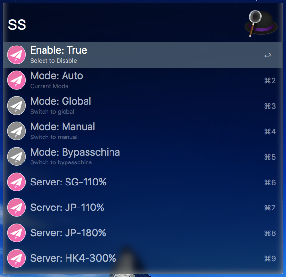

# Alfred_ShadowsocksController

ShadowsocksX-R controller for Alfred

Download:[Alfred_ShadowsocksController](https://github.com/yourtion/Alfred_ShadowsocksController/releases/download/0.2/ShadowsocksControler.alfredworkflow) 

Download From packal: [http://www.packal.org/workflow/shadowsockscontroller](http://www.packal.org/workflow/shadowsockscontroller)

ShadowsocksX-R version : [ssr_1.3.9 (11/18 fix ApiServer)](https://github.com/yichengchen/ShadowsocksX-R/releases/tag/sst_1.3.9)

基本功能已经完成并且可用

因为版本更新频繁，现在还是测试开发阶段，欢迎反馈问题，更多版本需要SS客户端支持，届时会进行更新，欢迎 Star 和 Watch

